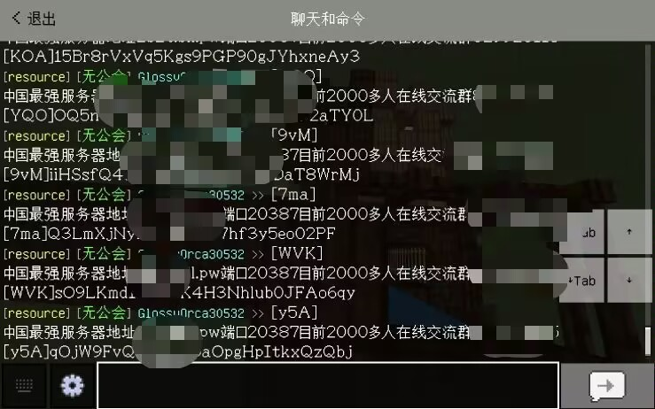
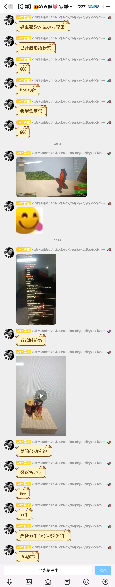

## LLBDS上的防聊天刷屏插件

### 因为最近有一个出生服主在星空服刷屏，所以有了该插件
### 如果该出生去到了你的服务器，就可以使用该插件来防止刷屏。



### 这个出生的视频评论区


### 这个出生的逆天发言



### 配置文件
```js
// 用于触发重新加载的命令
const reloadCommand = "asreload";
// 重新加载命令的冷却时间（单位：tick），以防止频繁重新加载
const cooldownTicks = 60
// 最大尝试次数，用于处理命令执行失败时的重试机制
const maxAttempts = 3
// 消息的最大长度限制，以防止过长的消息导致的问题
const maxLength = 100
// 当检测到用户发送的消息过于频繁时显示的警告信息
const messageTooSpam = "请不要刷屏!"
// 当用户发送的消息超过最大长度限制时显示的警告信息，其中 %maxLength% 会被替换为实际的最大长度值
const messageTooLong = "消息过长，请限制在 %maxLength% 字以内"
```